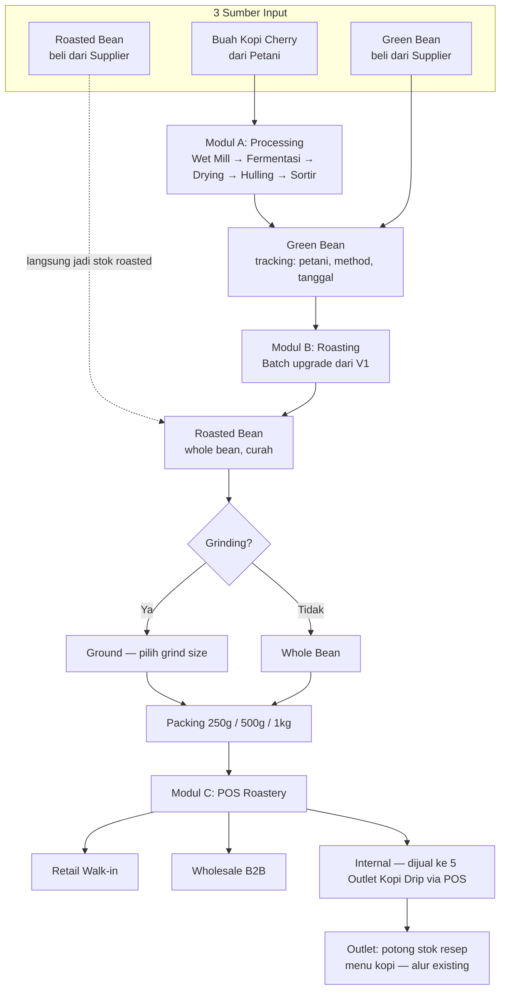

# FASE ROASTERY V2 — Farm-to-Cup Design

> Design blueprint. **Belum ada implementasi kode.** Menunggu review & approval Owner sebelum mulai Minggu 1. Rujukan aturan kerja: `CLAUDE.md` 3.3 (reuse), 3.5 (migration), 3.7 (verifikasi), 3.8 (kelengkapan menu).

**Tanggal dibuat**: 2026-09-26
**Status**: 📋 Design blueprint — menunggu approval Owner

---

## 1. Ringkasan Eksekutif

### Tujuan V2

Roastery V1 (`FASE_ROASTERY_DESIGN.md`, selesai 2026-09-24, lihat CLAUDE.md 4.20) hanya mencakup **satu potongan** dari bisnis roastery: batch roasting dari green bean yang sudah jadi (dibeli atau stok sedia) menjadi roasted curah, lalu dikemas dan didistribusikan ke outlet. V2 memperluas cakupan jadi **rantai penuh dari buah kopi sampai cangkir** — sekaligus membuka roastery sebagai **unit bisnis sendiri** yang jual ke luar (retail walk-in, wholesale B2B), bukan cuma pemasok internal 5 outlet Kopi Drip.

### Beda V1 vs V2

| | V1 (selesai) | V2 (design ini) |
|---|---|---|
| Titik mulai | Green bean sudah ada (beli/stok) | Buah kopi mentah dari petani, ATAU beli green/roasted langsung |
| Proses | Roasting → kemas → distribusi outlet | + Processing pasca-panen (wet mill/fermentasi/drying/hulling/sortir) + Grinding + Multi-kanal jual |
| Varian produk | 1 dimensi (varietas × roast level, curah) | + Processing method (Washed/Natural/Honey/Wine) + grind size + ukuran pack |
| Kanal jual | Internal 5 outlet saja | + Retail walk-in di roastery + Wholesale B2B + tetap suplai internal |
| Skala | Modul tambahan kecil (R1–R5, ~1 minggu) | Modul besar 3 sub-sistem (Modul A/B/C, 6–8 minggu) |

### 8 Keputusan Owner (basis design ini)

| # | Keputusan |
|---|---|
| Q1 | Outlet Kopi Drip membeli produk roastery **lewat transaksi POS** (dobel entry — outlet catat pembelian, roastery catat penjualan), BUKAN transfer stok gratis seperti V1 |
| Q2 | **1 harga** per produk (tidak beda harga per kanal), diskon dilakukan **manual** per transaksi kalau perlu |
| Q3 | Proses **Wine** dan **Honey** dimulai dari tahap **green** (bukan hasil roasting) — method menentukan cara buah diproses sebelum jadi green bean |
| Q4 | Roastery membeli **green bean maupun roasted bean** dari luar (dua-duanya, tidak eksklusif satu) — selain juga memproses buah sendiri |
| Q5 | **Ya**, processing dari buah kopi petani dilakukan sendiri (bukan cuma beli green bean jadi) |
| Q6 | Mulai dengan **10 SKU inti** dulu (lihat section 7), bukan katalog penuh |
| Q7 | Timing eksekusi: **sekarang** — alat dan tempat processing sudah siap di lokasi Owner |
| Q8 | Dikerjakan **penuh sekaligus** dalam 6–8 minggu (bukan dicicil per fase terpisah dengan jeda panjang) |

---

## 2. Alur Full Farm-to-Cup

### Sumber Input (3 jenis)

1. **Buah cherry dari petani** — masuk lewat Modul A (Beli Buah Kopi), diproses sendiri jadi green bean.
2. **Green bean beli langsung dari supplier** — pakai modul Pembelian (PO) yang sudah ada, masuk stok green tanpa lewat Modul A.
3. **Roasted bean beli langsung dari supplier** — juga lewat PO existing, langsung masuk stok roasted (skip Modul A **dan** proses roasting Modul B), tapi tetap bisa lewat Grinding/Packing.

### Output

- **Whole bean** (biji utuh) atau **Ground** (giling, dengan grind size) — sebagai atribut varian produk, bukan item terpisah per kombinasi (lihat section 6).
- Kemasan **250 g / 500 g / 1 kg** — melanjutkan pola pack V1 (`roasting_batch_packs`), diperluas untuk ground dan sumber non-batch (green/roasted beli langsung).

---

## 3. Modul A — Farm-to-Green Processing

**Cakupan**: dari buah kopi cherry di tangan petani, sampai jadi green bean siap roasting, dengan jejak asal (petani, kebun, method, tanggal) tetap melekat.

### Master Petani

Data pemasok buah cherry. Field minimum: kode petani, nama, alamat, telepon, nama/lokasi kebun asal. (Field opsional seperti foto kebun — lihat Pertanyaan Terbuka #4.)

### Beli Buah Kopi (Cherry)

Transaksi mirip Purchase Order (`PurchaseOrderController`/`PurchaseOrderRequest` — reuse pola validasi & approval, CLAUDE.md 3.3), tapi ke **Petani** bukan **Supplier**, dan itemnya adalah "Buah Kopi Cherry" (satuan kg), bukan item katalog biasa. Hasil: baris `cherry_purchases` (atau serupa) + stok cherry bertambah di lokasi processing (Gudang Pusat/Roastery).

### Processing Method

4 metode, dipilih saat batch processing dimulai:

| Method | Karakteristik singkat |
|---|---|
| **Washed** | Kulit & daging buah dikupas sebelum fermentasi, rasa bersih |
| **Natural** | Buah utuh dikeringkan dengan daging buah masih menempel, rasa lebih manis/kompleks |
| **Honey** | Sebagian daging buah (mucilage) disisakan saat drying — level honey (white/yellow/red/black) bisa jadi sub-pilihan |
| **Wine / Anaerobic** | Fermentasi tertutup tanpa oksigen sebelum drying — proses specialty, durasi & kontrol lebih ketat |

### Tahapan Proses (Batch Processing)

1. **Wet Mill** (khusus Washed) — kupas kulit buah
2. **Fermentasi** — durasi bervariasi per method (lihat Pertanyaan Terbuka #1)
3. **Drying** — jemur/dry sampai kadar air target
4. **Hulling** — kupas kulit tanduk (parchment) jadi green bean
5. **Sortir** — pisahkan green bean grade baik dari defect (lihat Pertanyaan Terbuka #2)

Setiap tahap dicatat sebagai **status batch berjalan** (`processing_batches.status`), bukan tabel terpisah per tahap — cukup timestamp mulai/selesai per tahap dalam 1 baris batch, supaya query riwayat sederhana (pola mirip `roasting_batches.status: draft→completed` di V1, diperluas jadi beberapa status berurutan).

### Output

Green bean baru dengan **tracking asal**: dari petani mana, kebun mana, method apa, tanggal processing — informasi ini penting untuk storytelling produk specialty (Wine/Honey) dan untuk Modul B tahu bahan bakunya dari jalur mana.

**Estimasi**: 3–4 minggu (bagian paling kompleks — banyak tahap, banyak state).

---

## 4. Modul B — Roasting + Grinding + Packing

### Batch Roasting (upgrade V1)

`RoastingBatchService`/`roasting_batches` (V1) di-**reuse**, diperluas supaya `green_bean_item_id` bisa berasal dari **3 jalur**: hasil Modul A (in-house), beli green langsung dari supplier, atau — untuk kasus beli roasted langsung — **skip roasting sepenuhnya** dan stok roasted langsung diisi dari PO.

### Grinding

Modul baru: roasted whole bean → ground. Input: qty whole bean (kg) + **grind size** (Extra Coarse / Coarse / Medium / Fine / Extra Fine). Output: item ground dengan grind size sebagai atribut, cost/kg diwariskan dari whole bean asalnya (ditambah opsional biaya proses giling kalau ada).

### Packing

Perluasan `roasting_batch_packs` (V1) — sekarang bisa mengemas dari **whole bean maupun ground**, dan sumbernya bisa dari batch roasting Modul B **atau** langsung dari stok roasted beli supplier (tanpa harus "batch" formal). Ukuran pack: 250 g / 500 g / 1 kg (sesuai V1).

### Cost Tracking

Cost per unit produk jadi (pack whole/ground) dihitung otomatis mewarisi semua biaya input di sepanjang rantai — beli cherry → processing → roasting → grinding → packing — memakai **FIFO cost existing** (`StokService`, `stock_batches`) di setiap tahap, konsisten dengan pola V1 (CLAUDE.md 4.20: "cost = harga green bean saja... FIFO existing").

**Estimasi**: 2 minggu.

---

## 5. Modul C — POS Roastery + Multi-Kanal

### Cabang Baru: Tipe "Roastery"

`app/Enums/TipeCabang.php` saat ini punya 3 case: `Cabang`, `GudangPusat`, `HeadOffice` — **belum ada** tipe untuk roastery-sebagai-unit-bisnis (GP001 selama ini dipakai sebagai lokasi roastery fisik, tapi bertipe `gudang_pusat`). Perlu keputusan desain: tambah case `Roastery` baru, atau tetap pakai `GudangPusat` dengan flag tambahan? (Rekomendasi: tambah case baru, supaya laporan & filter cabang bisa membedakan "gudang distribusi" vs "unit bisnis roastery yang jual sendiri".)

### Kas Roastery

Kas terpisah untuk transaksi roastery (retail + wholesale + jual ke outlet), mengikuti pola `Kas` existing (1 kas per cabang/tipe pembayaran — lihat `KasSeeder`, CLAUDE.md 4.12).

### 3 Kanal Jual, Semua Lewat POS (Q1)

| Kanal | Pembeli | Catatan |
|---|---|---|
| **Retail walk-in** | Pelanggan datang langsung ke roastery | POS existing (`PenjualanController`/`PenjualanService`) — reuse penuh |
| **Wholesale B2B** | Cafe lain, reseller | POS sama, kemungkinan perlu tipe pelanggan/harga grosir — tapi Q2 bilang 1 harga + diskon manual, jadi cukup pakai fitur diskon POS yang sudah ada |
| **Internal ke 5 Outlet** | Outlet Kopi Drip beli produk roastery | **Dobel entry (Q1)**: transaksi POS di roastery (roastery jual, stok roastery berkurang, kas roastery bertambah) DIIKUTI entry stok masuk di outlet (bisa manual atau auto-generate dari transaksi POS roastery — perlu diputuskan saat eksekusi) |

**Konsekuensi penting**: pola V1 "Transfer Stok gratis GP001 → outlet" (CLAUDE.md 4.21, distribusi awal) **digantikan** oleh transaksi jual-beli lewat POS untuk hubungan roastery↔outlet ke depannya. Transfer Stok existing tetap dipakai untuk kasus non-komersial lain (misal outlet↔outlet).

**Estimasi**: 1–2 minggu.

---

## 6. Arsitektur Database

### Tabel Baru

| Tabel | Isi | Rujukan V1 terdekat |
|---|---|---|
| `petani` | Master pemasok buah cherry: kode, nama, alamat, telepon, kebun asal | Pola `Supplier` (existing, `suppliers` table) |
| `cherry_purchases` | Transaksi beli buah dari petani (mirip PO) | `purchase_orders`/`purchase_order_items` |
| `processing_batches` | 1 baris = 1 batch processing cherry→green: petani_id, method (washed/natural/honey/wine), qty_cherry_kg, qty_green_output_kg, status per tahap, tanggal per tahap, cost | `roasting_batches` (V1) |
| `cherry_batch_movements` | Log pergerakan stok cherry per tahap processing (opsional — kalau butuh histori lebih detail dari sekadar status batch) | `stock_movements` (existing, reuse kalau cukup) |
| `grinding_batches` | 1 baris = 1 batch giling: item whole bean asal, qty, grind_size, item ground output | `roasting_batches` (pola serupa: input→proses→output) |

### Kolom Tambahan (Alter)

| Tabel | Kolom baru | Keterangan |
|---|---|---|
| `items` | `grind_size` (enum, nullable: extra_coarse/coarse/medium/fine/extra_fine) | Hanya terisi untuk item ground |
| `items` | `processing_method` (enum, nullable: washed/natural/honey/wine) | Terisi untuk green/roasted yang berasal dari Modul A |
| `cabangs` | Tidak perlu alter kolom — pakai `TipeCabang` enum, tambah case `Roastery` di file enum (bukan migration DB, karena kolomnya sudah string/enum existing) |

### Migration Plan (berurutan)

1. `create_petani_table`
2. `create_cherry_purchases_table` + `cherry_purchase_items` (kalau multi-baris per transaksi)
3. `create_processing_batches_table`
4. `create_cherry_batch_movements_table` (kalau dipakai — lihat Pertanyaan Terbuka)
5. `add_grind_size_and_processing_method_to_items_table`
6. `create_grinding_batches_table`
7. `create_kas` baris baru untuk cabang roastery (seeder, bukan migration struktur)

Urutan ini menjaga foreign key valid (tabel dirujuk harus ada dulu — CLAUDE.md 3.5) dan memisahkan migration struktural dari isi seeder.

---

## 7. Master Data Setup (10 SKU Inti)

| # | Kode (usulan) | Nama | Varian |
|---|---|---|---|
| 1 | RTB-ARABIKA-WASHED-LIGHT-W250 | Arabika Sidikalang Washed Light — Whole 250g | Washed, Light, Whole, 250g |
| 2 | RTB-ARABIKA-WASHED-MED-W250 | Arabika Sidikalang Washed Medium — Whole 250g | Washed, Medium, Whole, 250g |
| 3 | RTB-ARABIKA-WASHED-DARK-W250 | Arabika Sidikalang Washed Dark — Whole 250g | Washed, Dark, Whole, 250g |
| 4 | RTB-ARABIKA-WASHED-MED-G250 | Arabika Sidikalang Washed Medium — Ground 250g | Washed, Medium, Ground, 250g |
| 5 | RTB-ARABIKA-WINE-MED-W250 | Arabika Sidikalang Wine Medium — Whole 250g (specialty) | Wine, Medium, Whole, 250g |
| 6 | RTB-ARABIKA-HONEY-MED-W250 | Arabika Sidikalang Honey Medium — Whole 250g (specialty) | Honey, Medium, Whole, 250g |
| 7 | RTB-ROBUSTA-MED-W250 | Robusta Sidikalang Medium — Whole 250g | (method TBD/washed default), Medium, Whole, 250g |
| 8 | RTB-ROBUSTA-MED-G250 | Robusta Sidikalang Medium — Ground 250g | Medium, Ground, 250g |
| 9 | RTB-BLEND-HOUSE-MED-W250 | Blend House (Arabika+Robusta) Medium — Whole 250g | Blend, Medium, Whole, 250g |
| 10 | RTB-BLEND-ESPRESSO-MED-W250 | Blend Espresso (70A/30R) Medium — Whole 250g | Blend, Medium, Whole, 250g |

**Catatan**: SKU 9 & 10 (blend) tidak berasal dari 1 batch roasting tunggal — perlu logic "campur 2+ item roasted jadi 1 item blend" (mirip packing tapi dengan >1 sumber input). Ini extend dari `roasting_batch_packs` (V1, 1 sumber curah → banyak pack) menjadi kasus N-sumber → 1 output. Perlu didetailkan saat eksekusi Modul B.

Kode SKU di atas adalah **usulan**, ikuti pola `kode_item` existing (CLAUDE.md 8.2: snake/kebab pendek, prefix kategori) — sesuaikan saat implementasi kalau Owner mau format beda.

---

## 8. Rencana Eksekusi Bertahap (6–8 Minggu)

| Minggu | Fokus | Output |
|---|---|---|
| 1–2 | Master Data + Cabang Roastery + Master Petani | `TipeCabang::Roastery`, cabang roastery baru + kas-nya, tabel `petani`, 10 SKU inti ter-seed (struktur item, belum ada stok) |
| 2–3 | Modul A — Pembelian buah + Processing form | `cherry_purchases`, form mulai batch processing (pilih petani, method, qty cherry) |
| 3–4 | Modul A — Wet mill, fermentasi, drying, hulling, sortir | Alur status batch processing lengkap sampai output green bean dengan tracking asal |
| 4–5 | Modul B — Upgrade batch roasting + Grinding | `RoastingBatchService` terima green dari 3 jalur; modul Grinding baru (whole→ground) |
| 5–6 | Modul B — Packing multi-size + Cost tracking | Packing dari whole/ground, dari batch atau beli langsung; cost mengalir FIFO end-to-end |
| 6–7 | Modul C — POS Roastery + Multi-kanal | Cabang roastery bisa transaksi POS (retail/wholesale/internal), dobel-entry ke outlet |
| 7–8 | Testing E2E + Laporan Roastery + Polish | Skenario penuh cherry→cup teruji, laporan roastery (yield per tahap, cost breakdown), aturan 3.7/3.8 lengkap |

Checkpoint mingguan: tiap akhir minggu, demo hasil ke Owner sebelum lanjut minggu berikutnya — kalau ada penyesuaian, lebih murah diperbaiki di checkpoint dekat daripada di akhir 8 minggu.

---

## 9. Risk & Mitigation

| Risk | Mitigasi |
|---|---|
| Skala fitur besar (3 modul, banyak tabel baru) | Milestone mingguan dengan checkpoint demo ke Owner (section 8) — bisa berhenti/adjust di tiap checkpoint, bukan baru ketahuan masalah di minggu ke-8 |
| Owner belum tentu familiar istilah coffee processing (wet mill, hulling, dll) | Tooltip di tiap field kompleks + panduan "Cara Pakai" per menu baru (CLAUDE.md 3.6/3.8 — wajib, bukan opsional) |
| V1 (batch roasting) jadi usang/konflik dengan V2 | V1 **tidak dibuang** — `RoastingBatchService`/`roasting_batches`/`roasting_batch_packs` di-**refactor jadi bagian Modul B** (green bean multi-sumber), bukan ditulis ulang dari nol (CLAUDE.md 3.3) |
| Cost tracking rumit karena input berlapis (cherry→green→roasted→ground→pack) | Konsisten pakai FIFO `StokService`/`stock_batches` existing di **setiap** tahap — jangan bikin skema cost baru, reuse yang sudah proven di V1 |
| Data processing (fermentasi, drying) bisa berantakan kalau state terlalu granular | Status batch per tahap disimpan sebagai kolom timestamp dalam 1 baris (section 3), bukan tabel terpisah per tahap — jaga skema tetap sederhana |
| Dobel-entry outlet↔roastery (Q1) berpotensi selisih stok kalau prosesnya manual | Perlu diputuskan saat eksekusi Modul C: entry stok masuk di outlet auto-generate dari transaksi POS roastery, atau manual dengan rekonsiliasi berkala — didetailkan di Minggu 6–7, bukan diasumsikan sekarang |

---

## 10. Pertanyaan Terbuka + Next Step

### Perlu jawaban Owner sebelum/selama eksekusi

1. **Detail fermentasi Wine** — perlu input suhu & durasi harian yang presisi, atau cukup catat tanggal mulai–selesai (durasi total) tanpa detail suhu?
2. **Sortir biji cacat (defect)** — perlu di-track jumlah/persentase defect per batch (untuk analitik kualitas), atau cukup langsung dikurangi dari output tanpa dicatat terpisah?
3. **Timing grinding** — digiling **on-demand** per pesanan customer (grind size dipilih saat checkout), atau digiling di muka dalam batch besar lalu disimpan sebagai stok ground siap jual? Ini menentukan apakah Grinding perlu terhubung ke alur POS real-time atau cukup jadi modul produksi terpisah seperti Packing.
4. **Field Master Petani** — field wajib minimum apa saja? Perlu foto kebun / dokumentasi lain, atau cukup data kontak + lokasi kebun (teks)?

### Next Step

1. Owner review design ini secara menyeluruh (section 1–9)
2. Owner jawab 4 pertanyaan di atas (section 10) — jawaban ini akan menentukan detail skema `processing_batches`, `grinding_batches`, dan `petani`
3. Owner approve scope & urutan milestone (section 8)
4. Mulai eksekusi **Minggu 1–2**: Master Data + Cabang Roastery + Master Petani
